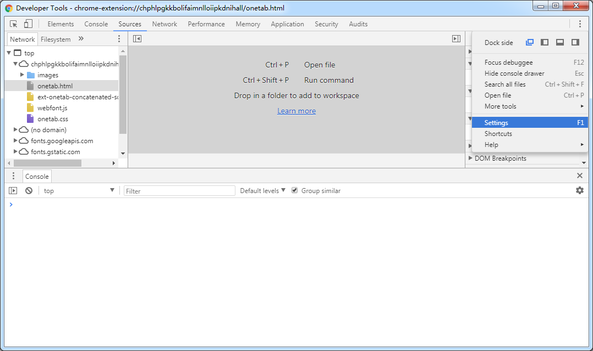
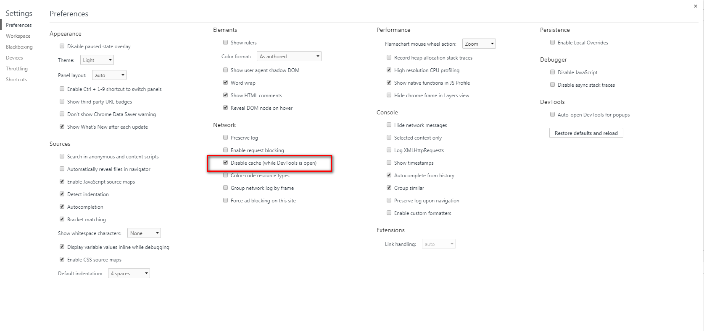

# 注意事项

> author: ljn

## blog的使用

> 1. 请使用`Chrome`或者`Firefox`等现代浏览器打开，其它浏览器不保证**没问题**。
> 2. 因为blog暂时**测试服务器**上，所以打不开时，注意地址。
> 3. 当你使用代理上网时，有可能打不开。
> 4. 当你打开blog时，没有看到更新时，不用担心这是**缓存问题**。

## 缓存

> 因为`docsify`使用浏览器的local storage来进行**索引**文章，所以不能频繁更新缓存。

### 强制浏览器刷新

> 请`F12`打开开发者工具，同时设置`setting > disable cache(while DevTool is open)`(Network主题下)

> 第一步：打开开发者工具

> 第二步：当打开devtool时，禁用缓存

