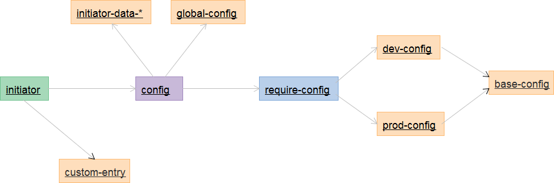

## initiator初始化器

> initiator模块主要作用是用来加载`requirejs`需要的`config`配置文件的，可以根据配置的运行环境进行加载不同模式(dev/prod)下的配置文件。

### options配置

> data-*配置的属性值只能是**字符串**。

| 名称                   | 默认值 | 属性值 | 备注                                    |
| ---------------------- | ------ | ------ | --------------------------------------- |
| data-env-mode          | prod   | dev    | 开发模式                                |
|                        |        | prod   | 生产模式                                |
| data-base-url          | js     |        | requirejs的baseUrl                      |
| data-custom-dev-config | --     |        | 开发模式扩展config文件路径，相对baseUrl |
| data-custom-config     | --     |        | 扩展config文件路径，相对baseUrl         |
| data-custom-entry      | --     |        | 页面的js入口文件路径                    |
|                        |        |        |                                         |


> **解释**: 
>
> data-env-mode：配置运行环境，initiator根据配置加载不同的`config`文件。
>
> data-base-url：直接改变`requirejs`的配置文件`baseUrl`。
>
> data-custom-dev-config：自己扩展了开发模式的`config`配置，这里配置`扩展文件地址`，相对`baseUrl`计算路径。
>
> data-custom-config：自己扩展了`config`配置，这里配置`扩展文件地址`，相对`baseUrl`计算路径。
>
> data-custom-entry：页面入口文件。
>


## 方法

> 无


## 使用

> 如果使用服务端模版技术，而且有`context`上下文的需要自己添加。

```html
<!-- 禁止改变顺序 -->
<script src="js/plugins/jquery/1.12.4/jquery.min.js"></script>
<script src="js/requirejs/js/require.js"></script>
<script src="js/initiator.js" data-env-mode="dev" data-base-url="" 
        data-custom-dev-config="" data-custom-config="" data-custom-entry="../index"></script>
```


### 加载流程

> initiator 先加载`requirejs`需要的`config`文件，合并 `config`文件，最后加载`custom-entry`入口文件。


